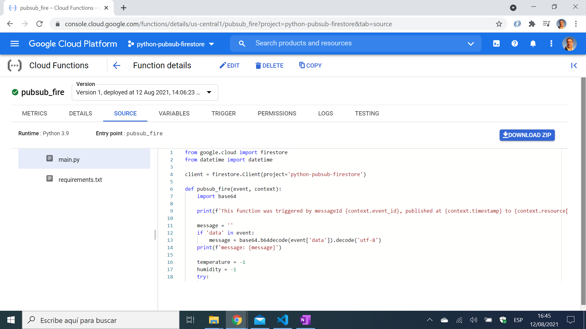
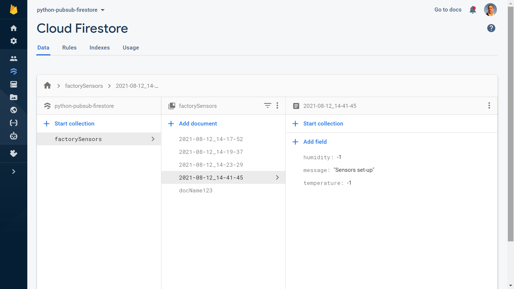

# :zap: Python Pub/Sub Firestore

* Google Cloud Functions used to send data using Python code to Google Cloud Pub/Sub where data can be published with a message
* Code from [D-I-Ry](https://www.youtube.com/channel/UCMHvK9tare9Y9O152C9wm3Q) with modifications - see [:clap: Inspiration](#clap-inspiration) below
* **Note:** to open web links in a new window use: _ctrl+click on link_


* [:zap: Python Pub/Sub Firestore](#zap-fastapi-python-sql)
  * [:page_facing_up: Table of contents](#page_facing_up-table-of-contents)
  * [:books: General info](#books-general-info)
  * [:camera: Screenshots](#camera-screenshots)
  * [:signal_strength: Technologies](#signal_strength-technologies)
  * [:floppy_disk: Setup](#floppy_disk-setup)
  * [:computer: Code Examples](#computer-code-examples)
  * [:cool: Features](#cool-features)
  * [:clipboard: Status & To-do list](#clipboard-status--to-do-list)
  * [:clap: Inspiration](#clap-inspiration)
  * [:envelope: Contact](#envelope-contact)

## :books: General info

* Pub/Sub used to pass messages between services and to trigger Cloud Functions to run workflow
* Cloud Functions python code deployed from VS Code terminal
* Missing how to add event attributes pressure, temperature and humidity.
* Cloud Build API has to be enabled for deployment to work
* From Pub/Sub factor-sensors topic is triggered by message published to pubsub factory sensors topic

## :camera: Screenshots




## :signal_strength: Technologies

* [Python v3](https://www.python.org/) programming language
* [Google Cloud Functions](https://cloud.google.com/functions) functions as a service (FaaS) to run Python code
* [Google Cloud Pub/Sub](https://cloud.google.com/pubsub) messaging and ingestion for event-driven systems and streaming analytics - in this case in Python.
* [Google Cloud FireStore](https://cloud.google.com/firestore) fully managed, scalable, and serverless document database.

## :floppy_disk: Setup

* Ref. tutorial
* `gcloud functions deploy pubsub_fire --runtime python39 --trigger-topic factory-sensors` to deploy to Cloud Functions

## :computer: Code Examples

* extract from `main.py` to create document for Firestore database with [structured format time - strftime](https://docs.python.org/3/library/time.html#time.strftime) stringified local timestamp as doc. reference
*  Code by [D-I-Ry](https://www.youtube.com/channel/UCMHvK9tare9Y9O152C9wm3Q) with modifications to strftime format

```python
temperature = -1
    humidity = -1
    try:
        if 'attributes' in event:
            attributes = event['attributes']
            temperature = attributes['temperature']
            humidity = attributes['humidity']

            print(f'temperature = {temperature}')
            print(f'humidity = {humidity}')
    except Exception as e:
        print(f'error with attributes: {e}')

    doc_id = datetime.now().strftime("%m/%d/%Y, %H:%M:%S")
    doc = client.collection('factorySensors').document(doc_id)
    doc.set({
        'message': message,
        'temperature': temperature,
        'humidity': humidity,
    })
```

## :cool: Features

* tba

## :clipboard: Status & To-do list

* Status: Working
* To-do: Find out how to add attributes in events

## :clap: Inspiration

* [D-I-Ry: Cloud Functions: from Pubsub to Firebase Cloud Firestore in Python](https://www.youtube.com/watch?v=TYItEci216w&t=109s)

## :envelope: Contact

* Repo created by [ABateman](https://github.com/AndrewJBateman), email: gomezbateman@yahoo.com
